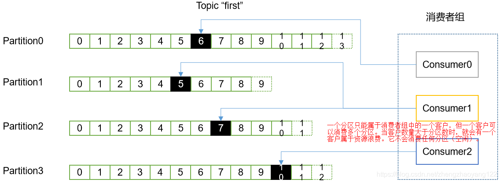

消费者不需要自行管理 offset（_分组+topic+分区_），系统通过 broker 将 offset 存放在本地。低版本通过 zk 自行管理。系统自行管理分区和副本情况。消费者断线后会自动根据上一次记录的 offset 去获取数据（默认一分钟更新一次 offset），同一个分组中的客户不能同时消费同一个分片。不同的 group 记录不同的 offset，这样不同程序读取同一个 topic 才不会因为 offset 互相影响。
## 一、消费者组

分区的所有权从一个消费者转移到另一个消费者，这样的行为称为再均衡，再均衡非常重要，它为消费者群组带来了高可用性和伸缩性（可以放心的添加和删除消费者），再均衡期间消费者无法读取消息，造成整个群组一小段时间的不可用。另外，当分区被重新分配给另一个消费者时，消费者当前的读取状态会丢失，它有可能还需要去刷新缓存，在它重新恢复状态之前会拖慢应用程序。通过心跳机制检测消费者是否活跃。
## 二、消费方式
::: danger
如果消费者提交了偏移量却未能处理完消息，那么就有可能造成消息丢失，这也是消费者丢失消息的主要原因。
:::
【1】Consumer 通过拉（pull）的模式从 broker 中读取数据【另一种是broker 向消费者推（push）数据】。推（push）模式存在一个问题：消费者的速率与 broker 推的速率不相同时，会导致资源浪费（消费者性能优于broker）和系统崩溃（消费者性能次于broker）。  
【2】它的目标是尽可能以最快的速度传递消息，但是这样容易造成 consumer 来不及处理消息，典型的表现就是拒绝服务以及网络拥塞。而pull 模式则可以根据 consumer 的消费能力以适当的速率消费消息。  
【3】pull 模式的不足之处是，如果 Kafka 没有数据，消费者可能会陷入循环中，一直返回空数据。针对此，Kafka 的消费者在消息数据时会传入一个时长参数，如果当前没有数据可供消费，Consumer 会等待一段时间之后再返回，这段时长即为 timeout。  
## 三、分区分配策略
【1】一个 Consumer Group 中有多个 consumer，一个 Topic 有多个 partition，所以就会涉及到 partition 的分配问题，即确定那个 partition 由那个 consumer 消费。由 partition.assignment.strategy 属性决定。Kafka 有两种策略：RoundRobin 根据组进行轮询分配【循环】、Range 根据 Topic 进行划分【范围：默认策略】。  
 ■  Range：该策略会把主题的若干个连续的分区分配给消费者。假设消费者 C1 和消费者 C2 同时订阅主题 T1 和 T2，并且每个主题有 3个分区。那么消费者 C1 有可能分配到这两个主题的分区0和分区1，而消费者 C2分配到这两个主题的分区2.因为每个主题拥有计数个分区，而分区是在主题内独立完成的，第一个消费者最后分配到的分区比第二个消费者多很多分区。当分区数量不能被消费者数量整除，就会出现这种情况。  
 ■  RoundRobin：把主题的所有分区逐个分配给消费者（交叉分配），消费者之间最多差一个分区。使用此分区策略来给消费者 C1 和 C2 分配分区是，C1 将分到主题T1的分区0和分区2以及主题2的分区1，消费者C2将分配到主题T1的分区1以及主题2的分区0和分区2。  
【2】分配分区的过程：在消费者要加入群组时，它会向群组协调器发送一个 JoinGroup 请求。第一个加入群组的消费者将成为“群主”。群主从协调器那里获得群组的成员列表（列表中包含了所有最近发送过心跳的消费者，它们被认为是活跃的），并负责给每一个消费者分配分区。它使用一个实现了让 PartitionAssignor 接口的类来决定那个分区应该分配给哪个消费者。分配完毕后，群主把分配情况列表发送给群主协调器，协调器再把这些信息发送给所有消费者，每个消费者只能看到自己的分配信息，只有群主知道群组里所有消费者的分配信息，这个过程会在每次再钧衡时重复发送。  
## 四、消费者的配置
【1】group.id：如果两个消费者具有相同的group.id，并且订阅了同一个主题，那么每个消费者会分到主题分区的一个子集（群组会读取主题所有的消息）。如果你希望消费者看到主题的所有消息，那么需要为他们设置唯一的 group.id。  
【2】auto.offset.reset：这个参数指定了在没有偏移量可提交时（比如消费者第1次启动时）或者请求的偏移量在 broker上不存在时，消费者会做些什么。这个参数一般两种配置，一种是 earliest，如果选择了这个配置，消费者会从分区的开始位置读取数据，不管偏移量是否有效，这样会导致消费者读取大量的重复数据，但可以保证最少的数据丢失。另一种是 latest（默认值），如果选择这个配置，消费者会从分区的末尾开始读取数据，这样可以减少重复处理消息，但很有可能会错过一些消息。  
【3】enable.auto.commit：这是一个非常重要的配置参数，可以让消费者基于任务调度自动提交偏移量，也可以在代码里手动提交偏移量。自动提交的好处是，在实现消费者逻辑时少考虑一些问题。如果在消息者轮询操作所有的数据，那么自动提交可以保证只提交已经处理过的偏移量。缺点是：无法控制重复处理消息。  
【4】auto.commit.interval.ms：与3中的参数有直接联系。如果选择了自动提交偏移量，可以通过该参数配置提交的频度，默认是每5秒提交一次。依赖来说，频繁提交会增加额外的开销，但也会降低重复处理消息的概率。  
【5】fetch.min.byte：消费者从服务器获取记录的最小字节数，broker 在收到消费者的数据请求时，如果可用的数据量小于该配置，那么它会等到有足够的可用数据时才把它返回给消费者。  
【6】fetch.max.wait.ms：指定 broker 的等待时间，默认是 500ms。如果没有足够的数据流入 Kafka，消费者获取最小数据量就得不到满足，最终导致 500ms 延迟。fetch.min.byte 被设置为 1MB，那么Kafka 在收到消费者的请求后，要么返回 1MB数据，要么在 500ms 后返回所有可用的数据，就看那个条件先得到满足。  
【7】max.partition.fetch.bytes：该属性指定了服务器从每个分区里返回给消费者的最大字节数。它的默认值是 1MB，如果一个主题有20个分区和5个消费者，那么每个消费者需要至少 4MB 的可用内存来接收记录。在为消费者分配内存时，可以给他们多分配一些，因为群组里有消费者发生崩溃，剩下的消费者需要处理更多的分区。  
【8】session.timeout.ms：指定了消费者在被认为死亡之前可以与服务器断开连接的时间，默认是3s。如果消费者没有在指定的时间内发送心跳给群组协调器，就被认为已经死亡，协调器就会触发再均衡，把它的分区分配给群组里的其他消费者。该属性与 heartbeat.interval.ms 紧密相关。 heartbeat.interval.ms 指定了 poll() 方法向协调器发送心跳的频率，session.timeout.ms 则指定了消费者可以多久不发送心跳。一般 hearbeat.interval.ms 是 session.timeout.ms 的三分之一。  
【9】client.id：任意字符串，broker 用它来表示从客户端发送过来的消息，通常被用在日志、度量指标和配额里。  
## 五、消费者组案列
需求：测试同一个消费者组中的消费者，同一时刻只能有一个消费者消费。

【1】在 hadoop102、hadoop103 上修改 kafka/config/consumer.properties 配置文件中的 group.id 属性为任意组名。
``` shell
[root@hadoop103 config]$ vi consumer.properties
group.id=yintong
```
【2】在hadoop102、hadoop103上分别启动消费者，启动命令如下：
``` shell
#老版本连接zk，新版本连接 broker集群
[root@hadoop102 kafka]$ bin/kafka-console-consumer.sh --zookeeper hadoop102:2181 --topic first 
--consumer.config config/consumer.properties
[root@hadoop103 kafka]$ bin/kafka-console-consumer.sh --zookeeper hadoop102:2181 --topic first 
--consumer.config config/consumer.properties
``` 
【3】在 hadoop104 上启动生产者：
``` shell
[root@hadoop104 kafka]$ bin/kafka-console-producer.sh --broker-list hadoop102:9092 --topic first
>hello world
```
【4】查看 hadoop102 和 hadoop103 的接收者：同一时刻只有一个消费者接收到消息。
## 六、Kafka 消费者 Java API
创建消费者：在读取消息之前，需要先创建一个 KafkaConsumer 对象。创建 KafkaConsumer 与创建 KafkaProducer 对象非常相似，将需要传送的属性放入 Properties 对象里。有三个必要的属性：boostrap.servers、key.deserializer 和 value.deserializer  props.put 中的 key 值，可以通过 ConsumerConfig.xxx 获取常量值（推荐）  
【1】bootstrap.servers：Kafka 集群的连接字符串。与在 KafkaProducer 中的用途是一样的。  
【2】key.deserializer 与 value.deserializer ：使用指定的类把字节数组转成 Java 对象。  
【3】group.id：不是必须的，但是很重要。它指定了 KafkaConsumer 属于哪一个消息群组。创建不属于任何一个群组的消费者也是可以的，只是这样不太常见。  

订阅主题：创建好消费者之后，下一步就是订阅主题。subscribe() 方法接收一个主题列表作为参数。我们也可以在调用 subscribe() 方法时传入一个正则表达式。正则表达式可以匹配多个主题，如果有人创建一个新的主题，并且主题的名字与正则表达式匹配，那么会立即触发一次再均衡，消费者就可以读取新添加的主题。如果应用程序需要读取多个主题，并且可以处理不同类型的数据，那么这种方式就很管用。在 KIafka 和其他系统之间复制数据时，使用正则表达式的方式订阅多个主题是很常见的做法。例如：cust.subscribe("test.*);

轮询：轮询（while循环）不只是获取数据那么简单。在第一调用一个新消费者的 poll() 方法时，它会负责查找 GroupCoordinator 协调器，然后加入群组，接收分配的分区。如果发生了再均衡，这个过程也是在轮询期间发生的。当然，心跳也是从轮询里发送出来的，所以，我们要确保在轮询期间所做的任何处理工作都应该尽快完成。
``` Java
public class CustomNewConsumer {
 
	public static void main(String[] args) {
                //kafkaConsumer 需要的配置参数
		Properties props = new Properties();
		// 定义kakfa 服务的地址，不需要将所有broker指定上 
		props.put("bootstrap.servers", "hadoop102:9092");
		// 制定consumer group 
		props.put("group.id", "test");
		// 是否自动确认offset 
		props.put("enable.auto.commit", "true");
		// 自动确认offset的时间间隔 
		props.put("auto.commit.interval.ms", "1000");
		// key的序列化类
		props.put("key.deserializer", "org.apache.kafka.common.serialization.StringDeserializer");
		// value的序列化类 
		props.put("value.deserializer", "org.apache.kafka.common.serialization.StringDeserializer");
		// 定义consumer 
		KafkaConsumer<String, String> consumer = new KafkaConsumer<>(props);
		
		// 消费者订阅的topic, 可同时订阅多个 
		consumer.subscribe(Arrays.asList("first", "second","third"));
 
                //这是一个无限循环，消费者实际上是一个长期运行的应用程序，他通过持续轮询向 Kafka 请求数据。
                try{
		    while (true) {
			// 消费者必须持续轮询对 Kafka进行轮询，否则被认为已经死亡，他的分区会被转移到群组里的其他消费者。
                        //读取数据，读取超时时间为100ms，参数用来控制 poll() 方法的阻塞时间，当消费者缓冲区没有数据时会发生阻塞。
			ConsumerRecords<String, String> records = consumer.poll(100);
			//poll 方法返回一个记录列表。每条记录都包含了记录所属主题的信息、记录所在分区的信息，记录在分区里的偏移量，以及记录的键值对。
			for (ConsumerRecord<String, String> record : records)
				System.out.printf("offset = %d, key = %s, value = %s%n", record.offset(), record.key(), record.value());
		    }
               }finally {
                    consumer.close();
               }
	}
}
```
## 七、偏移量
消费者可以使用 Kafka 来追踪消息在分区里的位置（偏移量），消费者往一个叫做 _consumer_offset 的特殊主题发送消息，消息里包含每个分区的偏移量。如果消费者一直处于运行状态，那么偏移量就没有什么用处。如果消费者发生崩溃或者有新的消费者加入群组，就会触发再均衡，再均衡之后，每个消费者可能分配到新的分区，而不是之前处理的那个。为了能够继续之前的工作，消费者需要读取每个分区最后一次提交的偏移量，然后从偏移量指定的地方继续处理。如果提交的偏移量小于客户端处理的最后一个消息的偏移量，就会导致重复处理。如果提交的偏移量大于客户单处理的最后一个消息的偏移量，就会导致数据丢失。所以，处理偏移量的方式对客户端有很大的影响。KafkaConsumer API 提供了多种方式来提交偏移量：  
【1】自动提交：最简单的提交方式是让消费者自动提交偏移量。enable.auto.commit 设置为 true，那么每过 5s，消费者会自动把从 poll() 方法接收到的最大偏移量提交上去。提交的时间间隔由 auto.commit.interval.ms 控制，默认5s。自动提交也是在轮询中完成。消费者每次在进行轮询时会检查是否该提交偏移量了，如果是，就会提交从上一次轮询返回的偏移量。但可能会造成5秒内的数据被重复处理。  
【2】手动提交当前偏移量：开发者通过控制偏移量提交时间来消除丢失消息的可能性。并在发生再均衡时减少重复消息的数量。开发者可以在必要的时候提交当前偏移量，而不是基于时间间隔。把 enable.auto.commit 设为 false，让应用程序决定何时提交偏移量，使用 commitSync() 提交偏移量最简单也可靠。这个 API 会提交由 poll() 方法返回的最新偏移量，提交成功后马上返回，如果提交失败就抛出错误。  
【3】异步提交：手动提交有一个不足之处，在broker 对提交请求作出回应之前，应用程序会一直阻塞，这样会限制吞吐量。可以通过降低提交频率来提升吞吐量，但如果发生再均衡，会增加重复消息的数量。这时就可以使用异步提交 API，只管发送提交，无需等待broker 的响应。commitAsync() 提交最后一个偏移量，然后继续做其他事。在碰到无法恢复的错误之前，commitSync() 会一直重试，但 commitAsync() 不会。原因是因为重试的过程中，可能有一个更大的偏移量提交成功了。但它提供了回调，当 broker 作出响应时会执行回调。回调经常用于记录提交错误或生成度量指标，不过如果要进行重试，那一定要注意顺序（对比回调中的偏移量是否与提交的偏移量相等，相等说明没有新的提交）。  
``` Java
consumer.commitAsync (new OffsetCommitCallback() {
    public void onComplete(Map<TopicPartition,OffsetAndMetadata> offsets,Exception e){
        if(e != null) log.error(offset,e);
    } 
});
```
4】同步和异步组合提交：针对偶尔出现提交失败，不进行重试不会有太大问题，因为如果提交失败是因为临时问题导致的，那么后续的提交总会有成功的，但如果这是发生在关闭消费者或再均衡前的最后一次提交，就要确保能够提交成功。因此，在消费者关闭前一般会组合使用 commitSync() 和 commitAsync()：
``` java
try {
    while(true) {
        //......
        consumer.commitAsync();
    }
} catch (Exception e) {
    log.error(e);
} finally {
    try {
        consumer.commitSync();
    } finally {
        consumer.close();
    }
}
```
【5】提交特定的偏移量：提交偏移量的频率与处理消息批次的频率是一样的。如果 poll() 方法返回一大批数据，为了避免因再均衡引起的重复处理整批消息，想要在批次中间提交偏移量该怎么办，这种情况无法通过 commitSync() 或 commitAsync() 来实现，因为它们只会提交最后一个偏移量，而此时该批次里的消息还没处理完。幸运的是，消费者 API 允许在调用 commitSync() 和 commitAsync() 方法时传进去希望提交的分区的偏移量的 map。举例：
``` java
//用于跟踪偏移量的 map
private Map<TopicPartition, OffsetAndMetadata> currentOffsets = new HashMap<>();
int count = 0;
 
//......

while(true) {
    ConsumerRecord<String,String> records = consumer.poll(100);
    for(ConsumerRecord<String,String> record : records){
        currentOffsets.put(new TopicPartition(record.topic(),record.partition()),new OffsetAndMetadata(record.offset()+1,"no metadata"));
    //假设偏移量是 5000，那么此时表示每1000提交一次便宜量
    if(count % 1000 == 0)
        consumer.commitAsync(currentOffsets,null);
    count++;
    }
}
```
## 八、再均衡监听器
消费者在退出和进行分区再均衡之前，会做一些清理工作。我们希望在消费者失去对一个分区的所有权之前提交最后一个已处理记录的偏移量。在为消费者分配新分区或移除旧分区时，可以通过消费者API 执行一些应用程序代码，在调用 subscribe() 方法时传入一个 ConsumerRebalanceListener 实例就可以了。该接口有两个需要实现的方法：  
【1】**onPartitionsRevoked(Collection\<TopicPartition\> partitions)**：会在再均衡开始之前和消费者停止读取消息之后被调用。如果在这里提交偏移量，下一个接管分区的消费者就知道该从哪里开始读取消息了。  
【2】**onPartitionsAssigned(Collection\<TopicPartition\> partitions)**：会在重新分配分区之后和消费者开始读取消息之前调用。  
``` Java
//提交时需要传入的 map 参数
private Map<TopicPartition, OffsetAndMetadata> currentOffsets = new HashMap<>();
 
//实现 ConsumerRebalanceListener  接口
private class HandleRebalance implements ConsumerRebalanceListener {
    //在获得新分区后开始读取消息，不需要做其他事情
    public void onPartitionsAssigned(Collection<TopicPartition> partitions){}
 
    //如果发生再均衡，我们再即将失去分区所有权的时候提交偏移量。提交的是最近处理过得偏移量，而不是批次的最后一个偏移量。
    public void onPartitionsRevoked(Collection<TopicPartition> partitions) {
        consumer.commitSync(currentOffsets );
    }
 
    try {
        //订阅主题时，需要传入 ConsumerRebalanceListener  实例
        consumer.subscribe(topics, new HandleRebalance());
        //轮询
        while(true) {
            ConsumerRecords<String,String> records = consumer.poll(100);
            for(ConsumerRecords<String,String> record: records ){
                currentOffsets.put(new TopicPartition(record.topic(), record.partition()),new OffsetAndMetadata(record.offset+1,"no metadata"));
            }
            //异步提交 offset
            consumer.commitAsync(currentOffsets, null);
        }catch (Exception e) {
            log.error(e);
        }finally {
            try{
                //同步提交 offset
                consumer.commitSync(currentOffsets);
            }finally {
                //关闭客户端
                consumer.close();
            }
        }
    }
}
```
## 九、如何退出
如果确定要退出循环，需要通过另一个线程调用 consumer.wakeup() 方法。如果循环运行在主线程里，可以在 ShutdownHook 里调用该方法。要记住，consumer.wakeup() 是消费者唯一一个可以从其他线程中安全调用的方法。调用 consumer.wakeup() 可以退出 poll()，并抛出 WakeupException 异常，或者如果调用 consumer.wakeup() 时线程没有等待轮询，那么异常会等到下一轮 poll() 时抛出。我们不需要处理 WakeupException，因为它只是调出循环的一种方式。不过，在退出线程之前调用客户端的关闭 close() 方法时很有必要的。它会提交任何还没有提交的东西，并向群组协调器发送消息，告知自己要离开群组，接下来就会触发再均衡，而不需要等到会话超时。
``` Java
Runtime.getRuntime().addShutdownHook(new Thread() {
    public void run() {
        consumer.wakeup();
        try {
            mainThread.join();
        } catch (InterruptedException e) {
            e.printStackTrace();
        }
    }
});
```
## 十、反序列化器
【1】生成消息使用的序列化器与读取消息使用的反序列化器应该是一一对应的。下面就自定义一个反序列化器：
``` Java
// 创建一个简单的类来表示一个客户
public class Customer {
    private int customerID;
    private String customerName;
 
    public Customer(int ID,String name) {
        this.customerID = ID;
        this.customerName = name;
    }
 
    public int getID() {
        return customerID;
    }
 
    public String getName() {
        return customerName;
    }
}
 
// 实现 Deserializer 反序列化接口
public class CustomerDeserializer implements Deserializer<Customer>{
    @Override
    public void configure(Map configs, boolean isKey) {
        //不做任何配置
    }
 
    @Override
    public Customer deserialize(String topic, byte[] data) {
        int id;
        int nameSize;
        String name;
        try {
            if(data == null) return null;
            if(data.length < 8) throw new SerializationException("size shorter");
            //将字节数据转换为 ByteBuffer
            ByteBuffer buffer = ByteBuffer.warp(data);
            id = buffer.getInt();
            nameSize = buffer.getInt();
            byte[] nameBytes = new byte[nameSize];
            buffer.get(nameBytes);
            name = new String(nameBytes, "UTF-8");
 
            return new Customer(id,name);
        }
    }
 
    @Override
    public void close() {
        //不需要关闭任何东西
    } catch (Exception e) {
        throw new SerializationException("Error when serializing Customer to byte[]"+e);
    }
}
```
【2】Thrift 序列化框架的使用：链接
## 十一、独立消费者
现在我们只需要一个消费者从一个主题的所有分区或者某个特定分区读取数据。此时就不需要消费者群组和再均衡，只需要把主题或者分区分配给消费者，然后开始读取消息并提交偏移量。如果这样就不需要订阅主题，取而代之的是为自己分配分区。一个消费者可以订阅主题（并加入消费者组），或者为自己分配分区，但不能同时做这两件事。当确定拉去的分区之后，通过 assign 方法获取消息。
``` Java
//向集群请求主题可用的分区。如果只打算读取特定分区，可以跳过这一步
List<PartitionInfo> partitionInfos = consumer.partitionsFor("topic");
if(partitionInfos != null) {
    for(PartitionInfo partition : partitionInfos){
        //进行业务逻辑实现，将需要订阅的分区，添加到partitions列表中
        partitions.add(new TopicPartition(partition.topic(),partition.partition()));
        //知道订阅那些分区之后，调用 assign 方法
        consumer.assign(partitions);
        //轮询
        while(true) {
            ConsumerRecords<String,String> records = consumer.poll(1000);
            for(ConsumerRecords<String,String> record: records){
                //......业务逻辑处理
            }
            consumer.commitSync();
        }
    }
}
```